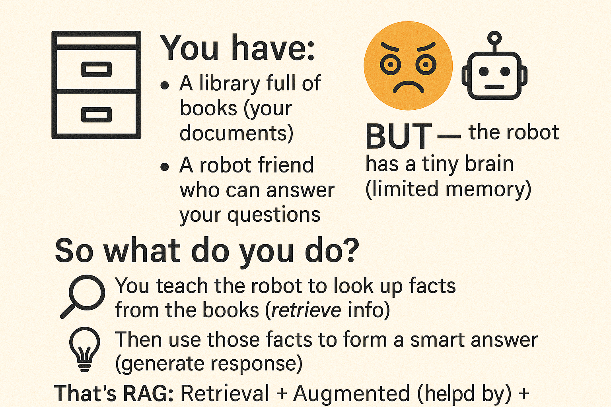

---

````markdown
# 📚 Mini RAG Project – Smart Answer Buddy 🤖

This mini project demonstrates a **Retrieval-Augmented Generation (RAG)** system using your own documents (like PDFs) to answer questions intelligently with the help of OpenAI's GPT model. It's a beginner-friendly, Jupyter-based implementation — designed to feel like you're building magic with code!

---

## 🚀 What is RAG?

**RAG = Retrieval + Generation**

🔍 First, it **retrieves** the most relevant content from your documents  
🧠 Then, it uses **Generative AI** (GPT-3.5) to generate a clear, smart answer  

In short: it’s like building your own ChatGPT that reads your notes before replying!

---

## 🛠️ Tech Stack

- Python
- Jupyter Notebook
- [LangChain](https://github.com/langchain-ai/langchain)
- [FAISS](https://github.com/facebookresearch/faiss) – for vector storage
- [OpenAI API](https://platform.openai.com)
- PyPDF2 – to read PDF documents

---

## 📦 Installation

```bash
pip install openai langchain faiss-cpu PyPDF2 tiktoken
````

---

## 📂 Files

* `rag_mini_project.ipynb` – Main Jupyter Notebook
* `your_notes.pdf` – Sample PDF to test the chatbot (add your own)
* `README.md` – This file

---

## 📄 How to Use

1. 🔑 Get your OpenAI API Key from [https://platform.openai.com/account/api-keys](https://platform.openai.com/account/api-keys)
2. 🧠 Upload a PDF document (like study notes or company policies)
3. 💬 Ask any question based on that document
4. 🤖 See GPT generate a contextual answer after retrieving relevant content

---

## ✅ Sample Question

```
Enter a question: What is RAG in NLP?

Answer:
RAG stands for Retrieval-Augmented Generation. It enhances LLMs by allowing them to retrieve relevant information from external sources before generating responses, increasing accuracy and reducing hallucination.
```

---

## 🧠 Learning Goals

* Learn how to use **LangChain and FAISS**
* Understand how **document embedding + GPT** enables custom Q\&A bots
* Practice **chunking, embedding, retrieval, and generation** steps

---

## 🎓 For Whom?

* Beginner Python coders
* AI/ML learners exploring LangChain or RAG
* Anyone who wants to turn boring PDFs into a smart Q\&A assistant

---

## 🙋 Author

**Pratap Jadhav**
Learning Generative AI and NLP — one mini project at a time 😄
Reach out: [LinkedIn](https://www.linkedin.com/in/pratap-jadhav/) | `#Smart5YODev`

---

## 📜 License

MIT – Free to use, modify, and learn from. Just give a shoutout if you like it 😇

```

---
